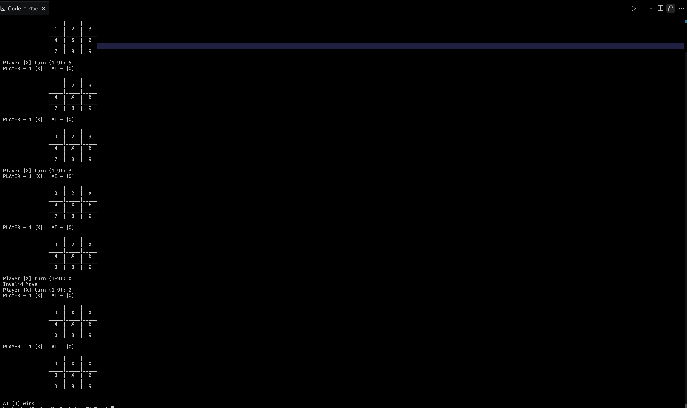
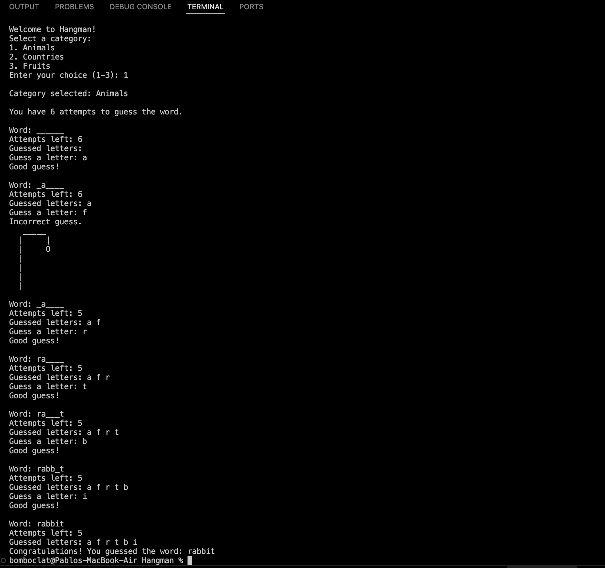
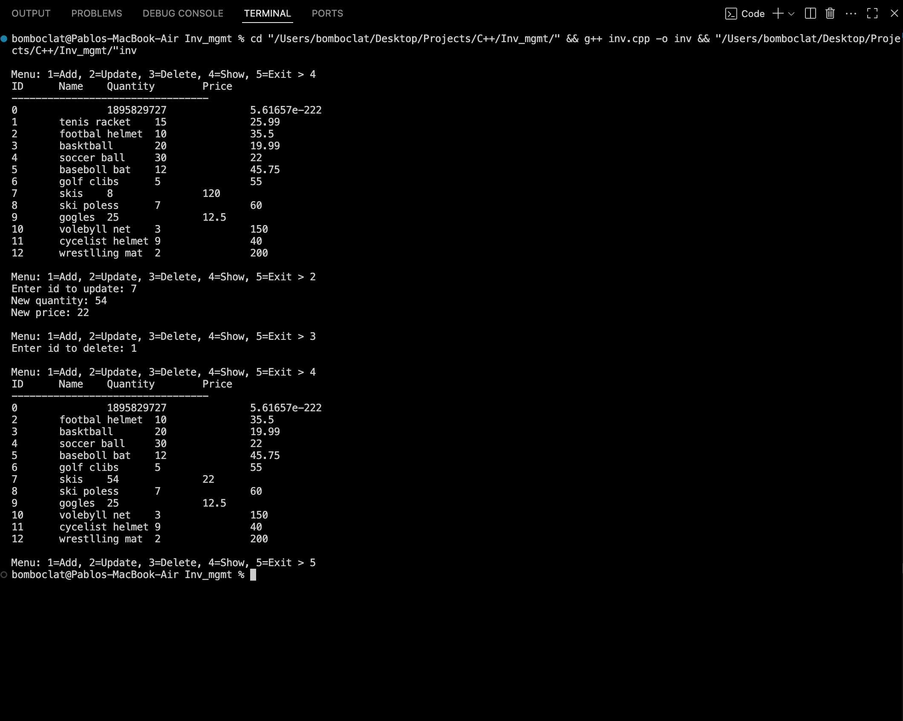

# cpp_projects

A curated set of three standalone C++ console applications:

- **Tic‑Tac‑Toe**
- **Hangman**
- **Inventory Management**

Each app is CLI‑based, written in modern C++17, and lives in its own directory.

---

## 🧭 Project Structure

    cpp_projects/
    ├── tic-tac-toe/
    │ └── main.cpp
    ├── hangman/
    │ ├── main.cpp
    │ └── words.txt
    ├── inventory-management/
    │ └── main.cpp
    └── images/
    ├── tictactoe.png
    ├── hangman.png
    └── inventory.png

---

## 🎮 App Previews

<table>
  <tr>
    <td align="center">
       
      <strong>Tic‑Tac‑Toe</strong>
    </td>
    <td align="center">
       
      <strong>Hangman</strong>
    </td>
  </tr>
  <tr>
    <td align="center">
       
      <strong>Inventory Management</strong>
    </td>
    <td></td>
  </tr>
</table>

---

## 🛠️ Building & Running

Compile and execute each program from its directory:

    cd TicTac
    g++ -std=c++17 main.cpp -o ttt
./ttt
Or for Hangman / Inventory Management:

    cd Hangman
    g++ -std=c++17 main.cpp -o hangman
    ./hangman

    cd ../Inv_mgmt
    g++ -std=c++17 main.cpp -o inv_mgr
    ./inv_mgr

📌 About Each Application
Tic‑Tac‑Toe
A two-player grid game with user prompts, turn validation, win/draw detection, and replay support.

Hangman
Guess a hidden word letter by letter before running out of tries. Reads from a words.txt file. Demonstrates file input, string handling, and loops.

Inventory Management
Features CRUD-like operations: add, remove, list products with name, ID, quantity, price. Utilizes STL containers and menu-based navigation.

📦 Requirements
A C++17–compatible compiler (e.g. g++, clang++)

Terminal environment (Linux/macOS/WSL)

Optional: make

🎯 Purpose & Use
Demonstrates foundational C++ skills: loops, conditionals, I/O, STL

Organized, self-contained projects for portfolio or interview preparation

Accompanied by visuals to preview functionality without running code

🧠 Why This README Works
Follows recognized best practices: clear overview, instructions, visuals, and structure (pitfalls-highlighted-readme)

Designed after examples from top open‑source C++ projects for clarity and usability. (Best‑README‑Template)

📞 Author
Soham‑047
GitHub: https://github.com/Soham-047
